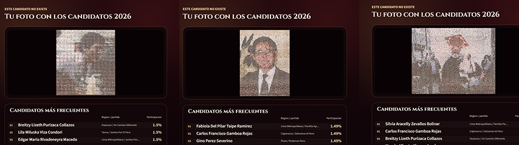
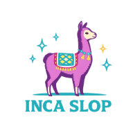
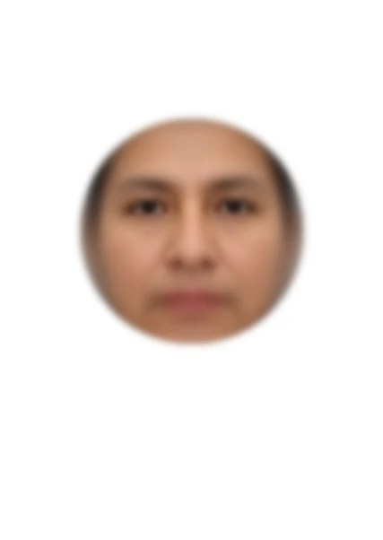

# Este candidato no existe

https://candidatos.incaslop.online/

Micrositio narrativo hecho con React + Vite sobre el "rostro promedio" de las candidaturas a diputados para las elecciones generals del Perú 2026. 

El recorrido termina con un generador de mosaicos que recompone tu foto usando retratos reales del dataset electoral.

Hecho con la gente del colectivo IncaSlop.
<p align="center">
  
</p>

<p align="center">
  
  
</p>

Las imagenes son obtenidas, y procesadas, desde: https://github.com/jruizcabrejos/candidato2026

## Que muestra

- Una apertura con la bandera del Peru y rostros promedio rotando por region y sexo,
- Un rostro promedio nacional con accesos a drawers comparativos por regiones y partidos,
- Un generador de mosaicos que corre completamente en el navegador, con exportacion de imagen y tarjeta en formato retrato.

## Desarrollo rapido

```bash
npm ci
npm run dev
```

El repo publico ya incluye los assets generados en `public/generated/` y los manifiestos en `src/generated/`, asi que no necesitas `output/` para levantar la app o compilarla.

## Scripts principales

```bash
npm run dev
```

Levanta Vite usando los assets ya versionados.

```bash
npm run build
```

Compila `dist/` sin regenerar assets.

```bash
npm run generate
```

Regenera los assets web desde los insumos internos. Este paso requiere el dataset local en `output/`.

```bash
npm run dev:full
npm run build:full
```

Versiones internas que regeneran assets antes de arrancar o compilar.

## Estructura publica

- `src/`: frontend en React.
- `public/generated/`: imagenes, atlas y assets web ya preparados.
- `src/generated/`: manifiestos consumidos por la app.

## Nota

Las carpetas pesadas de trabajo interno como `output/`, `tmp/` y `run/` no forman parte del shape publico del repositorio.
